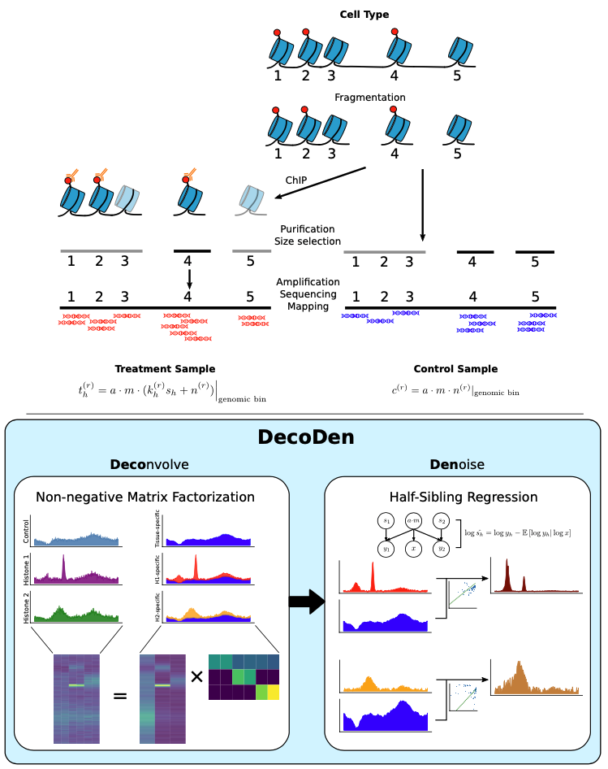

# Multi-histone ChIP-Seq Analysis with DecoDen



This is the accompanying code for the paper **Multi-histone ChIP-Seq Analysis with DecoDen**.


## Dependencies
DecoDen depends on MACS2, BEDOPS and BEDTools.

```sh
conda install -c bioconda macs2 bedops bedtools
```

## Usage

### Quick Start
#### Prepare data
DecoDen expects aligned reads in BED/BAM format. Create a CSV file with details about samples. The sample CSV file should contain `filepath`, `exp_name` and `is_control` columns. For an example look under `utils/samples.csv`. 

#### Running DecoDen
Run DecoDen with the following command
```bash
python run.py -i samples.csv -o results_dir \ # output directory
                             --n_train_bins 4000 \ # number of training genomic bins
                             --control_cov_threshold 0.1 \ # threshold with control coverage. use a value > (1/bin_size)
                             --chunk_size 100 \ # For the processing of the signal matrix
                             -bs 15 \ # genomic bin size. Choose between 15-200. Smaller values increase run time.
```

To know details about all possible input parameters, run
```bash
python run.py --help
```

If you would prefer to run preprocessing and DecoDen separately, use the following commands.

### Preprocessing
Pre-processing includes removing duplicate reads, extending reads and tiling the data into bins. These steps require MACS2, BEDOPS and BEDTools.

```bash
python run_preprocess.py -i "samples.csv" \ # CSV file with filepath and conditions
                         -o "output_directory" \ # directory for preprocessed files
                         -bs 200 \ # bin size for tiling (default 200)
                         -n 2 \ # number of jobs for parallelization (default 2)
```
The sample CSV file should contain `filepath`, `exp_name` and `is_control` columns. For an example look under `utils/samples.csv`. 

### Running DecoDen

To run DecoDen, the data must be preprocessed into bedGraph format and binned correctly. The algorithm requires a `json` file that indicates the correspondance of each file to the experimental condition.

**If you used `DecoDen` for preprocessing, this file is automatically generated for you. It will called `experiment_conditions.json` in the output folder.**

```javascript
{
    "control_1.bdg": "control",
    "control_2.bdg": "control",
    "h3k27me3_1.bdg": "H3K27me3",
    "h3k27me3_2.bdg": "H3K27me3",
    "h3k27me3_3.bdg": "H3K27me3",
    "h3k4me3_1.bdg": "H3K4me3",
    "h3k4me3_2.bdg": "H3K4me3",
    "h3k4me3_3.bdg": "H3K4me3"
}
```

To run DecoDen, an example command would be:
```bash
python run_decoden --data_folder "data/my_experiment" \ # where the .bdg files are saved
                   --output_folder "outputs/my_experiment_results" \ # where to save the results
                   --files_reference "data/my_experiment_files.json" \ # the aforementioned mapping
                   --blacklist_file "data/annotations/hg19-blacklist.v2.bed" \
                   --conditions "control" "H3K27me3" "H3K4me3" \ # Ordering of the experimental conditions. The first one must be the control.
                   --control_cov_threshold 1.0 \ # Minimum coverage for the training data for the NMF
                   --n_train_bins 300000 \ # Number of training bins for the extraction of the mixing matrix
                   --chunk_size 100000 \ # For the processing of the signal matrix
                   --seed 42 \ # Random state for reproductibility
                   --alpha_W 0.01 \ # Regularisation for the signal matrix
                   --alpha_H 0.001 \ # Regularisation for the mixing matrix

```